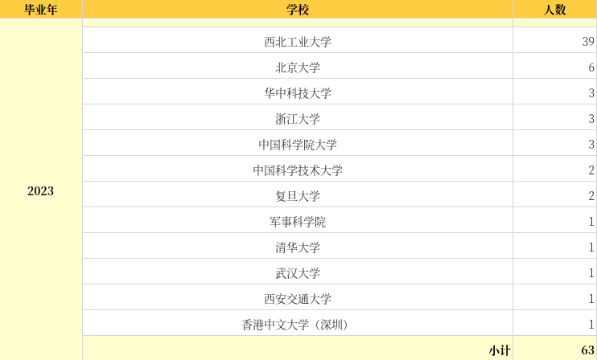
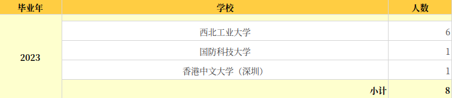
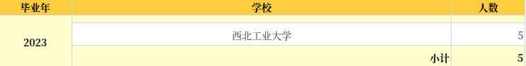

# 历年去向

计算机学院历年学长学姐的去向，可登陆**西北工业大学-毕业生就业数字化签约平台**查看：

[https://jobszqy.nwpu.edu.cn](https://jobszqy.nwpu.edu.cn)

登录后在左侧导航栏点击本学院历年就业情况即可。

以下是2023届计科专业保研去向：

2023届大数据专业保研去向：

2023届人工智能专业保研去向：

2023届物联网专业保研去向：

（以上数据截止2023.03.24，此时填写的都是保研的同学，不包括考研）

（此数据也未包含留学深造的同学，如新国立、港中文等等）
