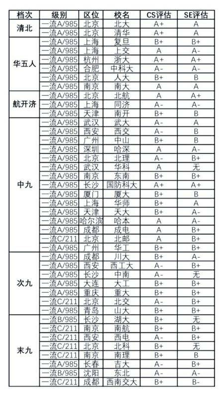

# 院校选择

## 院校排名

以上为“网友”总结的大致排名，其中学科评估参考为第四轮。

也可以参考[CS Rankings](https://csrankings.org/)上的排名。

## 院校情况

### 1. 夏令营
| 院校     | 院系             | 入营要求                                               | 机试         | 笔试            | 面试                                                  |
| -------- | ---------------- | ------------------------------------------------------ | ------------ | --------------- | ----------------------------------------------------- |
| 清华大学 | 计算机系         |                                                        |              |                 |                                                       |
| 北京大学 | 计算机学院       |                                                        |              |                 |                                                       |
| 北京大学 | 软件与微电子学院 | 难度不定，随当年报考人数决定                           |              |                 | 有                                                    |
| 上海交大 | 计算机学院       |                                                        |              |                 |                                                       |
| 上海交大 | 软件学院         | rank 10% CET-6 425                                     |              |                 |                                                       |
| 复旦大学 | 计算机学院       | rank 1%(预推免bar大幅降低)                             |              |                 |                                                       |
| 复旦大学 | 工研院           |                                                        |              |                 |                                                       |
| 复旦大学 | 类脑学院         |                                                        |              |                 |                                                       |
| 浙江大学 | 计算机学院       | 仅直博 CET-6 460                                       |              |                 |                                                       |
| 浙江大学 | 软件学院         | 优秀营员对西工大学生无效，因为不用这个也可以参加预推免 | 各营情况不同 | 同上            | 同上                                                  |
| 南京大学 | 计算机学院       | rank 10%                                               | 无           | 有，难度大于408 | 有，面试需准备英文介绍专业相关内容                    |
| 南京大学 | 软件学院         |                                                        |              |                 |                                                       |
| 南京大学 | 人工智能学院     | rank 10%                                               |              |                 |                                                       |
| 中国科大 | 计算机学院       | rank 10%                                               | 无           | 无              | 有两次，一次确定是否发offer一次确定是否能进心仪实验室 |
| 计算所   |                  | 需提前联系实验室                                       | 实验室安排   | 同上            | 有                                                    |
| 自动化   |                  | 需提前联系实验室                                       | 实验室安排   | 同上            | 有                                                    |
| 软件所   |                  |                                                        |              |                 |                                                       |
| 信工所   |                  |                                                        |              |                 |                                                       |

### 2. 预推免

| 院校     | 院系             | 入营要求                                     | 机试                                   | 笔试            | 面试                               |
| -------- | ---------------- | -------------------------------------------- | -------------------------------------- | --------------- | ---------------------------------- |
| 清华大学 | 计算机系         |                                              |                                        |                 |                                    |
| 北京大学 | 计算机学院       |                                              |                                        |                 |                                    |
| 北京大学 | 软件与微电子学院 | 难度低于夏令营                               |                                        |                 | 有                                 |
| 上海交大 | 计算机学院       |                                              |                                        |                 |                                    |
| 上海交大 | 软件学院         | 无预推免                                     |                                        |                 |                                    |
| 复旦大学 | 计算机学院       | rank 10%                                     |                                        |                 | 有                                 |
| 复旦大学 | 工研院           |                                              |                                        |                 |                                    |
| 复旦大学 | 类脑学院         |                                              |                                        |                 |                                    |
| 浙江大学 | 计算机学院       | rank10% 分软件工程和计科，计科难度略高于软工 |                                        |                 | 有                                 |
| 浙江大学 | 软件学院         | 较低，没有具体范围                           | 分AI和非AI方向，AI方向要求机试分数略高 | 无              | 有                                 |
| 南京大学 | 计算机学院       | rank 10%                                     | 无                                     | 有，难度大于408 | 有，面试需准备英文介绍专业相关内容 |
| 南京大学 | 软件学院         |                                              |                                        |                 |                                    |
| 南京大学 | 人工智能学院     | rank 10%                                     |                                        |                 |                                    |
| 中国科大 | 无预推免         |                                              |                                        |                 |                                    |
| 计算所   |                  | 需提前联系实验室                             | 实验室安排                             | 同上            | 有                                 |
| 自动化   |                  | 需提前联系实验室                             | 实验室安排                             | 同上            | 有                                 |
| 软件所   |                  |                                              |                                        |                 |                                    |
| 信工所   |                  |                                              |                                        |                 |                                    |

> 预推免阶段的中科院各所剩下的名额不多，需及时关注各个实验室的招生情况

